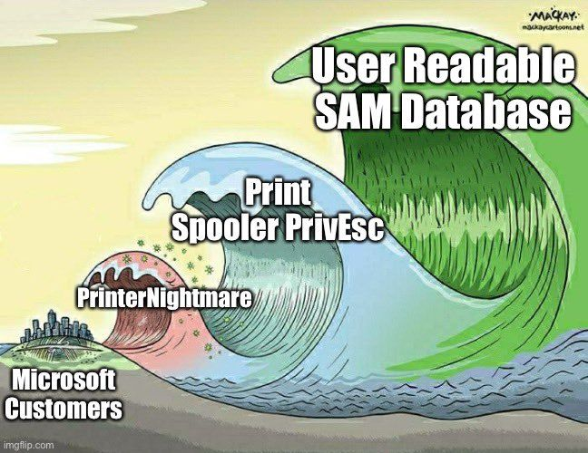

#   HiveNightmare

**HiveNightmare CV-2021-36934 (aka SeriousSAM)** this is Local Privilege Escalation vulnerability allows to that non-privileged local users can read access to the Security Account Manager (SAM), SYSTEM, and SECURITY Registry hive files and other critical files.

On July 20, 2021 Microsoft released the vulnerability as _Windows Elevation of Privilege Vulnerability_ __CVE-2021-36934__. Later July 22, 2021, the vulnerability has been confirmed to affect Windows 10 version 1809 as well as windows server 2019.

## About CVE-2021-36934
CVE Title: **Windows Elevation of Privilege Vulnerability**
URL: [https://msrc.microsoft.com/update-guide/en-US/vulnerability/CVE-2021-36934](https://msrc.microsoft.com/update-guide/en-US/vulnerability/CVE-2021-36934)

"An elevation of privilege vulnerability exists because of overly permissive Access Control Lists (ACLs) on multiple system files, including the Security Accounts Manager (SAM) database. An attacker who successfully exploited this vulnerability could run arbitrary code with SYSTEM privileges. An attacker could then install programs; view, change, or delete data; or create new accounts with full user rights." - Microsoft

## Exploit

Direct link: [https://github.com/GossiTheDog/HiveNightmare/raw/master/Release/HiveNightmare.exe](https://github.com/GossiTheDog/HiveNightmare/raw/master/Release/HiveNightmare.exe)

## Resources

[https://msrc.microsoft.com/update-guide/en-US/vulnerability/CVE-2021-36934](https://msrc.microsoft.com/update-guide/en-US/vulnerability/CVE-2021-36934)

[https://doublepulsar.com/hivenightmare-aka-serioussam-anybody-can-read-the-registry-in-windows-10-7a871c465fa5](https://doublepulsar.com/hivenightmare-aka-serioussam-anybody-can-read-the-registry-in-windows-10-7a871c465fa5)

[https://github.com/GossiTheDog/HiveNightmare](https://github.com/GossiTheDog/HiveNightmare)
